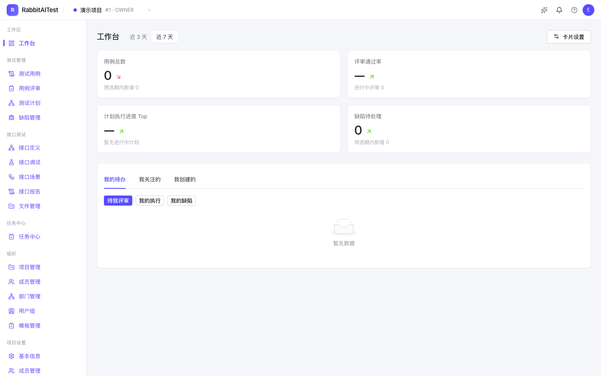

# RabbitAITest 文档

**RabbitAITest** 是一个开源的一站式测试工作台，提供 **测试管理（用例 · 评审 · 计划 · 缺陷）+ 接口测试（调试 · 定义 · 场景自动化 · Mock · 报告）+ AI 能力**，功能面对标 [MeterSphere](https://metersphere.io) v3.x 社区版。

```bash
git clone https://github.com/RabbitAI-Lab/RabbitAITest.git
cd RabbitAITest
pnpm install && pnpm dev
# 打开 http://localhost:3000
# 默认管理员：admin@rabbit.test / rabbit-admin-123
```



## 核心能力

| 模块 | 能力 |
| --- | --- |
| 测试管理 | 功能用例（列表 + 脑图双模式、MeterSphere 模板兼容导入导出）、用例评审（单人/多人模式）、测试计划（测试点、三类用例混排执行、计划组、报告导出 PDF/CSV）、缺陷管理 |
| 接口测试 | 接口调试（七区编辑器 + 断言面板）、接口定义（OpenAPI3/Postman/jmx 导入、用例与定义八区 diff、Mock 规则）、自动化场景（六类步骤、循环/条件/CSV 参数化、串行/并行执行）、报告与统计、误报规则 |
| Mock 服务 | 规则保存即热更新、多规则按匹配条件优先、延迟模拟、独立无状态可横向扩容 |
| AI 能力 | 模型网关（智谱/DeepSeek/OpenAI）、AI 生成功能用例与接口用例、流式智能助手、提示词自定义 |
| 协作 | 站内消息中心、五渠道通知机器人（站内信/邮件/企微/钉钉/飞书）、11 类事件、关注与 @ 提及 |
| 平台 | RBAC 权限（109 权限点）、多组织多项目、环境与全局参数、公共脚本、文件管理、三方缺陷平台集成（Jira/禅道/TAPD）、插件体系、资源池 |

## 从这里开始

- [产品介绍](quickstart/introduction.md) —— RabbitAITest 是什么，能力边界与版本说明
- [安装部署](quickstart/installation.md) —— 环境要求、启动、外部数据库与生产部署
- [快速体验](quickstart/quick-tour.md) —— 10 分钟走完「用例 → 调试 → Mock → 场景 → 计划 → 报告 → AI」主链路

## 文档导航

- **功能手册**：[通用功能](manual/common/overview.md) · [工作台](manual/workbench.md) · [功能用例](manual/test-track/case.md) · [用例评审](manual/test-track/review.md) · [测试计划](manual/test-track/plan.md) · [缺陷管理](manual/test-track/bug.md) · [接口调试](manual/api/debug.md) · [接口定义](manual/api/definition.md) · [自动化场景](manual/api/scenario.md) · [参数化与内置函数](manual/api/functions.md) · [Mock 服务](manual/api/mock.md) · [报告与统计](manual/api/report.md) · [环境管理](manual/project/environment.md) · [消息管理](manual/project/message.md) · [任务中心](manual/project/task-center.md) · [AI 能力](manual/ai.md) · [资源池](manual/system/pools.md) · [插件管理](manual/system/plugins.md) · [个人中心](manual/common/profile.md)
- **系统管理**：[用户与用户组](manual/system/users.md) · [参数设置](manual/system/params.md) · [认证与授权（企业版）](manual/system/enterprise.md)
- **开发文档**：[架构概览](developer/architecture.md) · [二次开发指南](developer/contributing.md)
- [常见问题](faq.md) · [关于与版本](about.md)

?> 本站基于 [Docsify](https://docsify.js.org) 构建，所有依赖已本地化（`docs-site/vendor/`），离线 / 内网环境可直接访问。文档本地预览方式见[二次开发指南](developer/contributing.md)。
