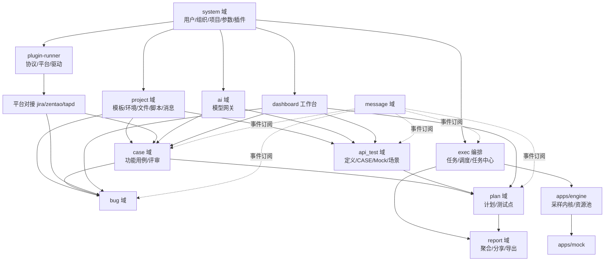

# 模块依赖关系图

| 元信息项 | 内容 |
| --- | --- |
| 文档层级 | 架构文档（全局约束） |
| 状态 | 已确认（Approved） |
| 下游消费 | plan 文档 §五依赖链、全部迭代概览的依赖章节 |

---

## 1. 运行时模块 DAG



**箭头语义**：A → B 表示 B 依赖 A 提供的实体或接口。跨域引用一律经 Provider 接口（test-domain-model §3），图中的域依赖即 Provider 消费方向。

## 2. 关键路径（决定排期不可压缩）

```
test-domain-model → INFRA-003 → CASE-001 + API-001
                                    │
engine-execution-architecture → EXEC-001 → EXEC-002 → API-008(场景批量执行)
                                                            │
PROJ-002(模板) → BUG-001 → INTG-001/002                      │
PROJ-003(环境) → API-002 → API-006(场景) → PLAN-002 → PLAN-005(计划报告)
```

- **最长链**：环境 → 接口定义 → 场景 → 计划 → 计划报告（横跨 Sprint 2-4，是 23 周节奏的主约束）
- 引擎链（EXEC-001→002）与测试管理链（PROJ-002→BUG-001）互不阻塞，可两班并行

## 3. 迭代间阻塞关系

| Sprint | 阻塞下游 | 说明 |
| --- | --- | --- |
| Sprint 0 | 全部 | 建表基线 + 引擎内核 v0 + HTTP 调试闭环 |
| Sprint 1 | S2-S5 | 模板字段/计划基础是接口域与缺陷域的上游 |
| Sprint 2 | S3-S4 | 环境与资源池调度是场景执行前提 |
| Sprint 3 | S4 | 场景可执行是计划关联场景用例的前提 |
| Sprint 4 | S5 | 计划报告导出依赖报告快照机制定型 |
| Sprint 5 | S6 | 消息事件源齐备后才做机器人通知模板 |
| Sprint 6 | S7-S9 | 插件 SPI 冻结是 AI 网关与 ENTP 的前置无关项，但平台插件冻结阻塞 ENTP 验收 |
| Sprint 7-8 | S9 | AI 与稳定化可并行企业版文档产出 |
| Sprint 9 | P4 | License 门控是 ENTP-* 唯一入口依赖 |

## 4. 禁止的依赖方向（Review 检查项）

1. `apps/engine` 不得依赖 `apps/web` 与 `packages/db`（不直连数据库，状态经 BullMQ 队列与 HTTP 回调）
2. `plan / bug / exec / report` 不得直接引用 `case / api_test` models（只能 Provider）
3. `case` 与 `api_test` 互不依赖（MeterSphere 中功能用例关联接口用例经 provider，本项目同构）
4. 前端 `packages/ui` 不得依赖业务 Store 与 api-client 之外的接口层
