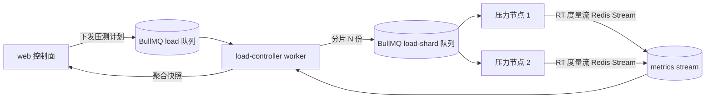

# 分布式压测架构稿（LOAD-002 · 企业版方向，纯规格）

| 元信息项     | 内容                                                                                                     |
| ------------ | -------------------------------------------------------------------------------------------------------- |
| 文档编号     | LOAD-002                                                                                                 |
| 所属迭代     | Sprint future — 远期 P4                                                                                  |
| 优先级       | P4（远期增强级）                                                                                         |
| 所属模块     | LOAD 性能测试（架构设计稿）                                                                              |
| 文档状态     | Implemented（2026-09-28 架构稿交付=本文档评审通过；无代码交付面，测试豁免登记 §5）                       |
| 最后更新日期 | 2026-09-28                                                                                               |
| 上游依赖     | LOAD-001（占位资产）、engine-execution-architecture.md（BullMQ 单队列拓扑）、EXEC-002（资源池/心跳契约） |
| 下游消费     | ENTP 企业版性能测试迭代（License 激活后按本稿实施）                                                      |
| 上游依据     | 需求文档「明确不做（P4 远期）：性能测试（分布式压测）」；MeterSphere v1/v2 曾以 JMeter 分布式压测实现    |
| 对标基线     | MeterSphere功能清单 §12.10（v1/v2 性能测试基于 JMeter 分布式压测，v3 社区版移除、企业版方向）            |
| 关联架构文档 | engine-execution-architecture.md、tech-stack.md（执行引擎不用 JMeter，仅兼容 jmx 导入）                  |
| 高保真确认   | 不适用（纯架构规格，以本「接口契约/拓扑评审」替代——本文档即评审对象）                                    |
| 工作量估算   | 规格 1 人日（实施属企业版迭代，不在本仓排期）                                                            |

## 1. 概述

### 1.1 功能定位

为「分布式压测」预写**企业版方向架构设计稿**：标准版红线（AGENTS 门禁 6）明确不自研压测内核、不做性能测试；本规格把将来企业版激活时的实施路径、拓扑与契约**写定**，使 LOAD-001 占位资产与 ENTP 迭代可以无缝衔接。**本规格无代码交付**。

### 1.2 范围边界（能力行 → §5 用例映射）

| 能力                                      | P1 ✅ | 后续                                                        |
| ----------------------------------------- | ----- | ----------------------------------------------------------- |
| 分布式压测拓扑设计（controller/压力节点） | ✅    | （本文档即交付物）                                          |
| 压测任务生命周期与事件流契约              | ✅    | 同上                                                        |
| 与既有 BullMQ 执行拓扑的演进路径          | ✅    | 同上                                                        |
| 压测内核/施压线程池实现                   | ❌    | 企业版迭代（红线：标准版不自研压测内核）                    |
| jmx 压测计划兼容导入                      | ❌    | 企业版迭代（本项目 jmx 兼容仅限接口用例导入，既有口径不变） |
| 压测报告/监控采样（TPS/RT 曲线）          | ❌    | 企业版迭代                                                  |

### 1.3 前置依赖

LOAD-001 占位资产（模块开关/权限点/池 DTO 字段）已交付；engine-execution-architecture 既有 worker/心跳/槽位契约稳定。

### 1.4 对标基线核对

基线（清单 §12.10）：v1/v2 性能测试基于 JMeter 分布式（master-slave 施压），v3 社区版完全移除，仅留企业版方向占位。本项目**同口径**：标准版不实现；差异化决策——企业版实施时**不用 JMeter 内核**（技术栈约束：执行引擎纯 Node.js），以 Node 施压进程等价复刻 jmeter 分布式语义（见 §6）。

## 2. 业务逻辑

### 压测任务生命周期（企业版实施时）

```
Draft → Scheduled(等待压力节点就位) → RampingUp(阶梯加压) → Steady(稳态施压)
      → RampingDown → Finished(Success|Aborted) → ReportReady
```

- 施压参数：阶梯（起始并发/目标并发/步长/时长）、持续时间、采样断言（可选，仅对探针请求）。
- 中止语义：任意时刻可 Abort（controller 向全部压力节点发 STOP 事件，节点在 ≤2s 内停止发压并上报已发总量）。

### 拓扑



- **controller**：单消费者，负责分片、阶梯调度（按步长向 shard 发 RAMP 事件）、聚合各节点秒级度量（发压数/成功数/失败数/RT 分位）成秒级时间线。
- **压力节点**：复用 EXEC-002 心跳注册（ResourcePool type 扩展 `LOAD` 值，`loadTest:true` 池字段激活），每节点 p-limit 并发槽发压；进程内采样，1s 窗口聚合上报（不走引擎 ExecTask 事件流，避免与功能执行混淆）。
- **报告**：秒级时间线（TPS/失败率/RT P50/P95/P99）+ 资源水位（节点 CPU/内存自报），落 `Report(reportType="load")`，summary JSON 扩展 `metrics` 键。

## 3. UI/UX 设计

企业版迭代时在 LOAD-001 占位页位置替换为真实模块（压测任务列表→任务详情实时曲线→报告对比）。本规格不产出原型（无本迭代 UI 交付）。

## 4. 技术架构

- **队列命名**：`load` / `load-shard`（与功能执行 `exec` 队列物理隔离，避免施压流量挤占功能任务）；Redis Stream key `load:metrics:{taskId}`。
- **与既有拓扑的演进路径**：Phase 1（本稿）单 controller + BullMQ shard 队列；Phase 2（规模需要时）controller 选主多实例（Redis 锁）；**不引入**外部消息系统（中间件红线仅 PG/Redis/MinIO）。
- **契约冻结项**（企业版实施不得变更）：压测计划 zod schema 骨架（阶梯四元组/时长/探针断言）、STOP 事件语义、秒级度量信封 `{ts, sent, ok, fail, rtP50, rtP95, rtP99}`。
- **安全**：压测目标 URL 必须过 SSRF 守卫（复用 MSG-001 webhook 双重守卫）；内网目标需管理员显式登记白名单（规则同 FILE-001 仓库地址）。

## 5. 测试用例

| 编号        | 类型 | 说明                                                                               |
| ----------- | ---- | ---------------------------------------------------------------------------------- |
| LOAD-002-T1 | 豁免 | 无代码交付面：单测/jmx/e2e 全豁免（登记理由=纯企业版方向架构稿，标准版无实现可测） |

## 6. 竞品深度对标

| 维度     | MeterSphere v1/v2（JMeter 分布式） | 本项目企业版方向                        | 决策理由                                           |
| -------- | ---------------------------------- | --------------------------------------- | -------------------------------------------------- |
| 施压内核 | JMeter remote 施压                 | Node 施压进程（undici + p-limit）       | 技术栈约束：引擎纯 Node.js，不引入 JVM             |
| 节点协调 | JMeter master-slave RMI            | BullMQ shard 队列 + Redis Stream 度量   | 复用既有中间件（Redis），零新增运维面              |
| jmx 兼容 | 原生                               | 不支持压测 jmx（接口用例 jmx 导入不变） | 施压计划以结构化 schema 表达，避免 JMeter 语义全集 |
| 报告     | JMeter 聚合报告                    | 秒级时间线 + 分位数                     | 前端渲染自绘 SVG 曲线（零图表库依赖先例）          |

## 7. 里程碑与验收

本规格交付=本文档评审通过（Approved）。验收=ENTP 迭代实施时以本稿为唯一架构依据，偏离须先修订本稿（状态回 Draft）。
